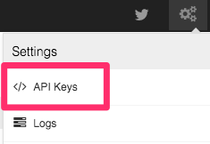

# Zype Roku Template App

This is a boilerplate Rails App using the Zype Platform and Zype Gem.

## Setup

1. You will need your Zype API and Player keys. You can find these in the [Zype Platform](https://admin.zype.com/) under the 'Settings' and 'Video Apps' menu.

2. Clone the repo

3. Update the following commands:

  * ROKU_DEV_TARGET: The IP address of your Roku device on your local network.
  * DEVPASSWORD: Your Roku's developer password.

4. Update your Zype configuration. Update the config located here under [source/objects/config.brs](source/objects/config.brs), and enter the following values:

  * key: Your Zype API Key
  * app: Your Zype Player Key
  * player: Your Zype App Key

5. Build the Roku app

  * Run 'make' in your project directory

6. Brand your images. We have supplied sample images with correct dimensions. To customize your images,
switch the mm_icon, mm_side, and splash screen images that are located in the images
directory. You will also need to supply a 290 x 218 JPG HD Channel Image and a 214 x 144 SD Channel
Image when you create your Channel in the Roku Store.

## License

[![Creative Commons License][image-1]][1]  
This work is licensed under a [Creative Commons Attribution 4.0 International License][1].

[1]:    http://creativecommons.org/licenses/by/4.0/

[image-1]:  https://i.creativecommons.org/l/by/4.0/88x31.png
